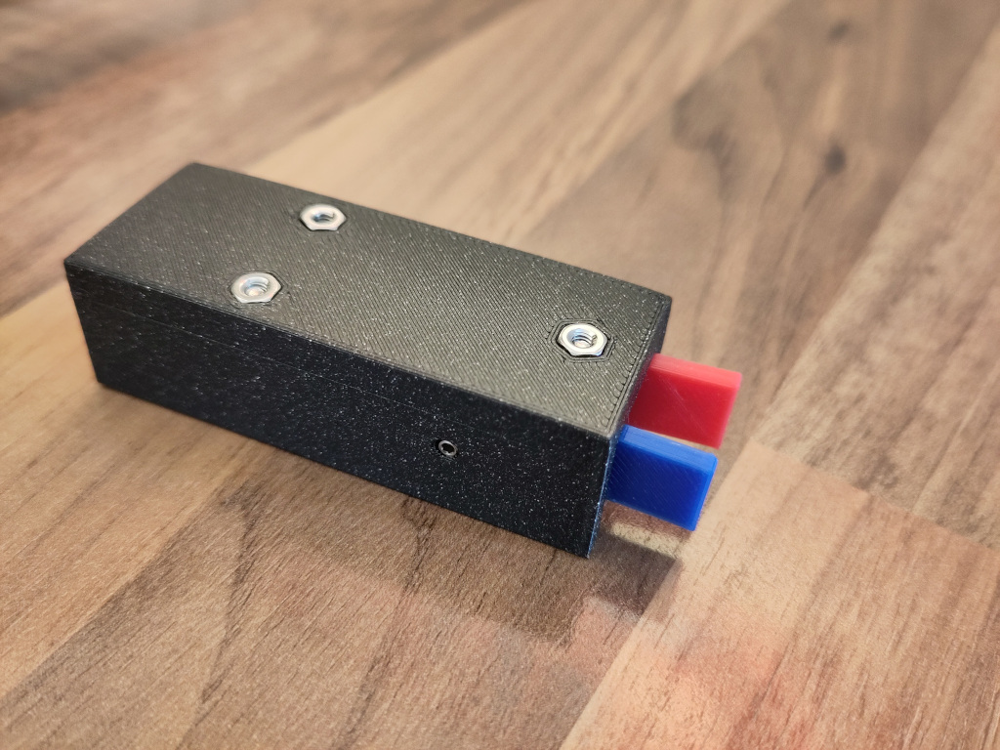
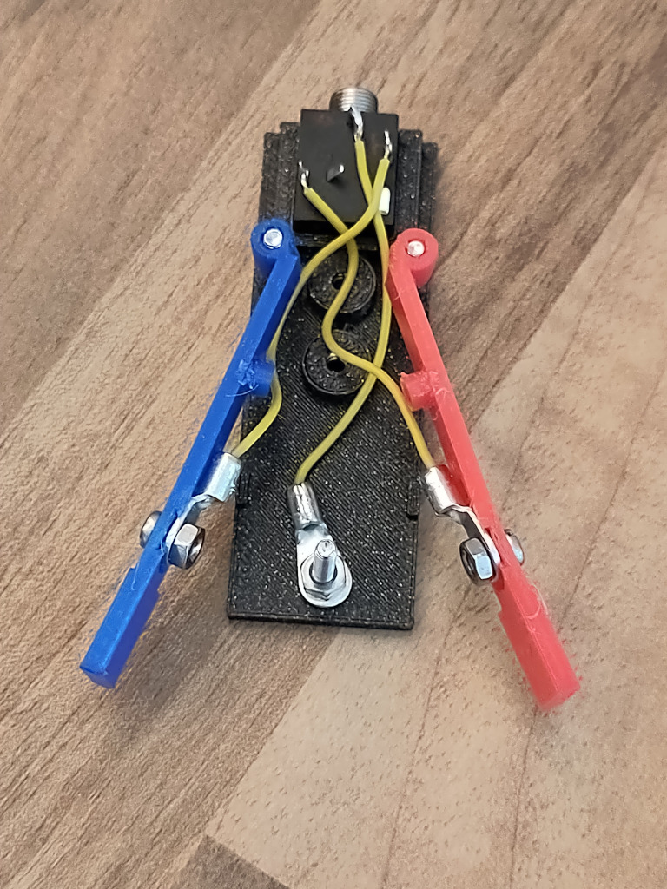

# OpenPaddle

A Morse paddle project in OpenSCAD.

It goes without saying but this is free software. If you don't have the TRS jack used in this build, you can change the design to accomodate the TRS jack you want to use. If you think the unit is too small, too large, too long, too short: edit it to suit your needs. You want your call sign embossed? Be my guest.

## Bill of materials

There is some [additional hardware needed](BOM.md) to build this project. Some pieces are mandatory to build the paddle but others are optional and can be omitted when certain features are not needed.

## How to build

### Main paddle unit

1. Print the plastic parts
	* [base.scad](base.scad)
		* If you plan (or rather: cannot rule out) to attach the paddle to some sort of base plate later, make sure to pause the print when the base nut fixtures are yet open and insert a 2.5mm nut into each of them. Then resume printing.
	* [case.scad](case.scad)
	* [paddle.scad](paddle.scad)
		* This needs to be printed twice: once straight out of the file and once mirrored.
2. There is a small cylinder fixed at the paddle print. Break it off and attach it with a drop of glue to the paddle right below where it was attached into the round recess. This will later keep the spring in place.
3. Clean the holes for the screws.
4. If paddle adjustment is wanted, put a 2.5mm nut into the slot at the side of the case print. This will keep the grub screw in place. You need to be careful not to push it too far because it will be hard to get out without damaging the print. Then, screw in the grub screws that are used to adjust the paddles.
5. Cut three wired to a length of 2cm, remove about 3mm of insulation from either end. Attach one cable shoe to each of the wires on one end (by crimping or soldering) and solder the other end to the pins of the TRS jack.
6. Using the short screws and a nut, attach the cable shoes that are soldered to the TR pins of the TRS jack to the paddles.
7. Put the TRS jack into the recess at the end of the base print, maybe fixing it using a drop of glue.
8. Put 16mm screws through the holes in the base plate.
9. Slide the paddles on the side screws.
10. Fix the middle contact cable shoe to the middle contact screw using a 2.5mm nut.
11. Slide the case print onto the base assembly, maybe using a bit of force to make it fit. You can use a screw driver to drive the screws into the holes at the top of the case print.
12. Secure the screws at the top using nuts.
13. Use a small TRX screw driver to adjust the paddles with the grub screws.
14. You are QRV.

### Options

* [housing.scad](misc/housing.scad) is a sliding housing ripped off the Palm Pico paddles. Just print it, preferrably standing upwards, secured by some brim.

